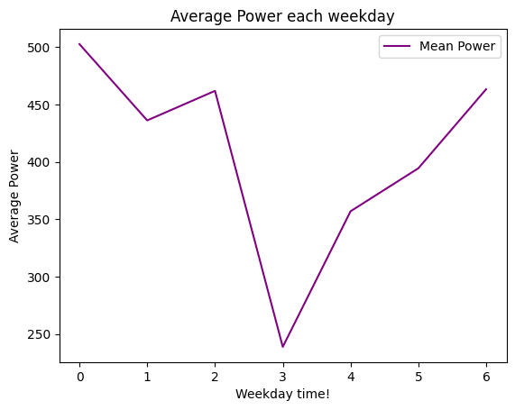

## Time Series Analysis and Forecasting Power for Wind Turbine data

## Table of Contents

1. [Data](#data)
2. [Task - Predicting how many orders Wolt may get in next hour](#task)
3. [Data Analysis and Modelling](#data-analysis-and-modelling)
4. [Modelling](#modelling-:rocket:)
5. [Working with files](#working-with-files)

---

## This repo is based on Python 3.10

All the requirements are present in the requirements.txt file.

Install requirements using ``pip install -r requirements.txt``

## Data

* **Time series.** I have choosen this dataset [provided file](data/Turbine1.csv) mainly as a process fluctuating in time.

---

## Task

* **Forecast Power .** - Building a forecasting model for predicting how much power will be generated by Turbine? 

---

## Data Analysis and Modelling

### Data Exploration :chart_with_upwards_trend:

For detail Analysis, go check this [notebook](code/data_analysis.ipynb).

Here are some insights of data -:

1. **Hourly Analysis** :hourglass:

2. **Weekly Analysis**

3. **Power Fluctuation with time**

4. **Power according to Wind**

### Data Processing

* **Data Deriving**

    - Derive some data fron existing columns such as date, hour, weekday from TIMESTAMP

### Modelling :rocket:

- Modelling according to only wind data 
  - Regression Modelling [notebook](code/modeling.ipynb) - Linear Regression, Decision Tree Regressor, Random Forest Regressor.
- Modelling according to other sensors data 
  - Regression Modelling
- Modelling using LSTM [notebook](code/lstm_modelling.ipynb) (utilising time stamp information) for univariate modelling (multivariate can also be performed.)

* **Data Preparation for LSTM Modelling**

  - Group data based on date and hour as we are doing hourly prediction.

### Evaluation :memo:

This the output from the two approaches -:

1. Regression Based (using other sensors data)

Output of DT Regressor for test data

Test data is sorted according to wind 

Training set r2 score: 0.9999999999980613
Test set r2 score: 0.9804207307047448

2. LSTM Modelling (Timestamp information)

Test data predictions using LSTM

-----

## Working with files

For the easy to understand the code, I have utilized jupyter notebooks otherwise can also be converted to python script.

Data analysis and modelling notebooks contains the main conclusions and answers to the question.

* **[data_analysis](code/data_analysis.ipynb)** - *It contains all analysis*

* **[utility.py](code/utility.py)** - *It contains utility functions for LSTM Modelling*

* **[modeling.ipynb](code/modeling.ipynb)** - *It contains the regression modelling analysis*

* **[lstm_modeling.ipynb](code/lstm_modelling.ipynb)** - *It contains the LSTM modelling analysis*

## Theoritical Tasks

**Q1. Turbit primarily deals with time-series data generated by sensors for temperature, pressure and other quantities. Which modern time-series forecasting approach would you choose to model such data? Describe its advantages and disadvantages. How would you implement it using tensorflow?**

Ans1. There are several modern forecasting approaches. Listing the following:
1. RNN/LSTM based approach (both univariate and multivariate)
2. Temoral Convolutional Neural Network (1-d convolutional)
3. DeepAR (based on RNN)
4. Temporal Fusion Transformer (LSTM, self-attention)

With tensorflow, it is easily possible as creating deep neural network architecture is easy to implement with Keras (high-level API - sequential or Functional API).
For time series data we have to use windowing technique to generate (process) data to feed to neural network.

I have also provided one example for univariate model using LSTM with tensorflow.

**Q2. When it comes to electrical power generation, we observed that the measured power values fluctuate a lot from one moment to the next. What are the implications of this behavior for modeling the power data?**

Ans2. There can be key considerations when dealing with power data from wind turbines -:

1. Noise: High fluctuations can sometimes be noise. It is crucial to do the robust data preprocessing for it.
2. Data Smoothing: Smoothing techniques like moving average and exponential smoothing can be applied to smoothen the data.
3. Data Granuality: Grouping the data based on hourly, weekly also matters which can again smoothen out these fluctuations.

**Q3. When reporting turbine anomalies, customers usually want to know the underlying reason for the unusual data points. Imagine that a thermometer in the gearbox of a turbine suddenly started reporting temperatures ten degrees higher than expected. List possible causes for such a pattern and how Turbit could distinguish between them?**

Ans3. Gearbox oil temperature is one of the indicators for gearbox codition monitoring.
Predicting the gearbox oil temperature helps in maintaining the safety and reliability of the wind turbines.
I study about the sudden change in the temperature in wind turbine can be because of different reasons, one of them is gaerbox oil temeprature.
There are proven research which can predict the early faulty warning of wind turbines. Turbit can adapt the existing solutions in the reasearch work 
for thier data.

